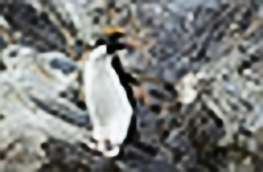
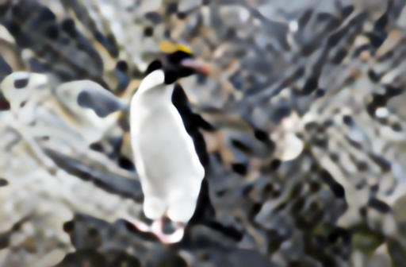

# Image Super Resolution  

## Examples
Below are some examples showing how to run the <code>main.py</code> demo and the associated color transfers between images.

+ **EDSR**

<code>$ >python main.py --phase 'train' --hr_train_path 'DIV2K_train_HR/' --lr_train_path 'DIV2K_train_LR_x8/' --hr_val_path 
 'DIV2K_valid_HR/' --lr_val_path 'DIV2K_valid_LR_x8/' --scale 8 --res_scale 0.1 --last_act 'sigmoid' --normalization 1 --augment</code>

<code>$ >python main.py --phase 'test' --test_file 'images/0801x8.png' --scale 8 --last_act 'sigmoid' normalization 1</code>

|  LR   | EDSR_sigmoid | EDSR_None|
|  ----  | ----  | ----  |
|   |  |  |

+ **RCAN**