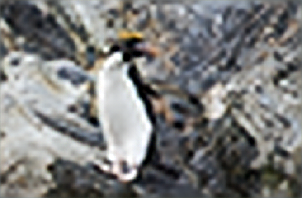

# Image Super Resolution  

## Examples
Below are some examples showing how to run the <code>main.py</code> demos. 

+ **EDSR** CVPR2017

<code>$ >python main.py --phase 'train' --hr_train_path 'DIV2K_train_HR/' --lr_train_path 'DIV2K_train_LR_x8/' --hr_val_path 
 'DIV2K_valid_HR/' --lr_val_path 'DIV2K_valid_LR_x8/' --scale 8 --res_scale 0.1 --last_act 'sigmoid' --normalization 1 --augment</code>

<code>$ >python main.py --phase 'test' --test_file 'images/0801x8.png' --scale 8 --last_act 'sigmoid' --normalization 1</code>

+ **RCAN** ECCV2018

<code>$ >python main.py --phase 'train' --model 'RCAN' --hr_train_path 'DIV2K_train_HR/' --lr_train_path 'DIV2K_train_LR_x8/' --hr_val_path 
 'DIV2K_valid_HR/' --lr_val_path 'DIV2K_valid_LR_x8/' --scale 8 --n_rg 10 --n_rcab 20 --n_feats 64 --normalization 2 --augment</code>

<code>$ >python main.py --phase 'test' --model 'RCAN' --test_file 'images/0801x8.png' --scale 8 --n_rg 10 --n_rcab 20 --n_feats 64 --normalization 2</code>

+ **DDBPN** CVPR2018

<code>$ >python main.py --phase 'train' --model 'DDBPN' --hr_train_path 'DIV2K_train_HR/' --lr_train_path 'DIV2K_train_LR_x8/' --hr_val_path 
 'DIV2K_valid_HR/' --lr_val_path 'DIV2K_valid_LR_x8/' --scale 8 --n_feats 128 --nr 32 --n_depths 6 --normalization 2 --augment</code>

<code>$ >python main.py --phase 'test' --model 'DDBPN' --test_file 'images/0801x8.png' --scale 8 --n_feats 128 --nr 32 --n_depths 6 --normalization 2</code>

+ **DBPN-RES-MR** Arxiv2019

<code>$ >python main.py --phase 'train' --model 'DBPN_MR' --hr_train_path 'DIV2K_train_HR/' --lr_train_path 'DIV2K_train_LR_x8/' --hr_val_path 
 'DIV2K_valid_HR/' --lr_val_path 'DIV2K_valid_LR_x8/' --scale 8 --n_feats 256 --nr 64 --n_depths 7 --n_iters 3  --global_res --normalization 2 --augment</code>

<code>$ >python main.py --phase 'test' --model 'DBPN_MR' --test_file 'images/0801x8.png' --scale 8 --n_feats 256 --nr 64 --n_depths 7 --n_iters 3 --global_res --normalization 2</code>

+ **RDN** CVPR2018

<code>$ >python main.py --phase 'train' --model 'RDN' --hr_train_path 'DIV2K_train_HR/' --lr_train_path 'DIV2K_train_LR_x8/' --hr_val_path 
 'DIV2K_valid_HR/' --lr_val_path 'DIV2K_valid_LR_x8/' --scale 8 --D 20 --G 32 --C 6 --n_feats 64 --normalization 2 --augment</code>

<code>$ >python main.py --phase 'test' --model 'RDN' --test_file 'images/0801x8.png' --scale 8 --D 20 --G 32 --C 6 --n_feats 64 --normalization 2</code>

+ **AFN** CVPR2020

<code>$ >python main.py --phase 'train' --model 'AFN' --hr_train_path 'DIV2K_train_HR/' --lr_train_path 'DIV2K_train_LR_x8/' --hr_val_path 
 'DIV2K_valid_HR/' --lr_val_path 'DIV2K_valid_LR_x8/' --lr 1e-5 --batch_size 8 --scale 8 --n_feats 128 --n_l3 3 --act 'leaky_relu' --normalization 2 --augment</code>

<code>$ >python main.py --phase 'test' --model 'AFN' --test_file 'images/0801x8.png' --scale 8 --n_feats 128 --n_l3 3 --act 'leaky_relu' --normalization 2</code>

| Method  | Img1 | Img2 |
| ---- | :----: | :----: | 
| LR |  |  |
| HR |  |  |
| EDSR_sigmoid |  |  |
| EDSR_None |   |  | 
| RCAN |   |  | 
| RCAN_InstanceNorm |   |  | 
| RDN |   |  | 
| AFN |   |  | 
 
